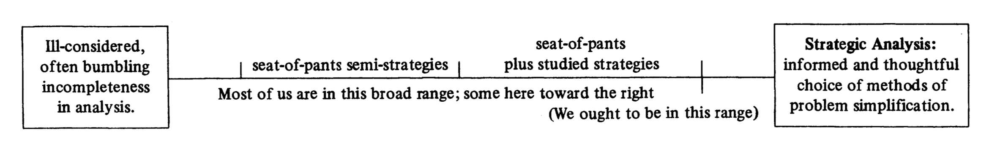

I am in love with this diagram from Charles Lindblom's paper "Still Muddling, Not Yet Through":

The gist of this paper (and it's predecessor, "The Science of Muddling Through") is that a lot of effort is invested in studying idealized methods for how to comprehensively analyze a situation and make a globally best decision, *but that is basically never the skill that anyone is able to exercise*.

Instead, we are all under multiple competing pressures — especially deadlines — having to make a good-enough-for-now assessment and stay in motion. If we idealize methods that work in conditions we never face and ignore the development of methods that actually match our circumstances, we will perform much worse than would otherwise be possible.

Hence, aiming for "seat-of-pants plus studied strategies". At his most poetic moment, Lindblom says:

> Although the myth of Icarus stimulates the imagination, flying becomes a productive ambition only to those who accept the impossibility of flying without mechanical assistance and who entertain the thought of using fabricated wings and other devices.

Related, in *Software Estimation: Demystifying the Black Art*,  Steve McConnell distinguishes between the art and science of estimation, where the latter uses complex methods to reduce &pm;10% uncertainty in estimates to &pm;5%, while:

> […] the typical software organization is not struggling to improve its estimates from &pm;10% to &pm;5% accuracy. The typical software organization is struggling to avoid estimates that are incorrect by 100% or more.

I'm a geek and I like learning the ins and outs of various software architectures, how [cool neural networks are structured](), etc. But also I'm well aware from 13 years as a software developer that many problems really just need a good spreadsheet and [good operational practices](). Sure, I'm going to keep learning programming languages for fun (one of these days, *Structure and Interpretation of Computer Programs*) and expanding my amateur data scientist toolkit, but as I approach 39, I can have the humility to accept that what might really make the difference… is getting better at project management.