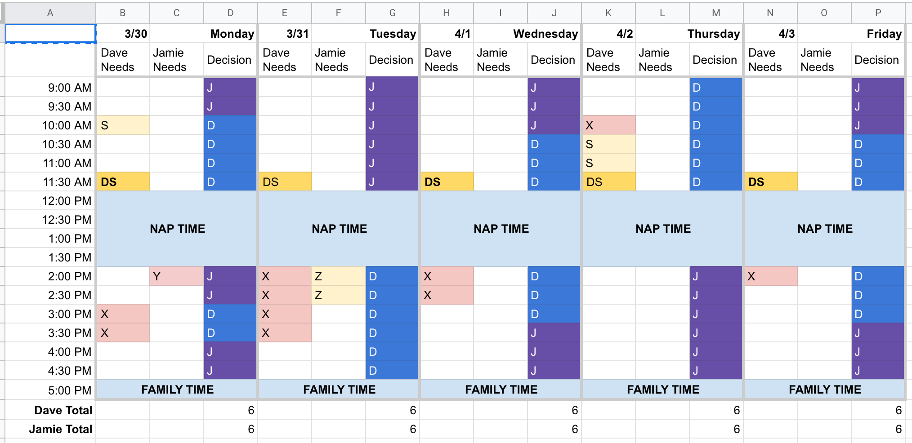
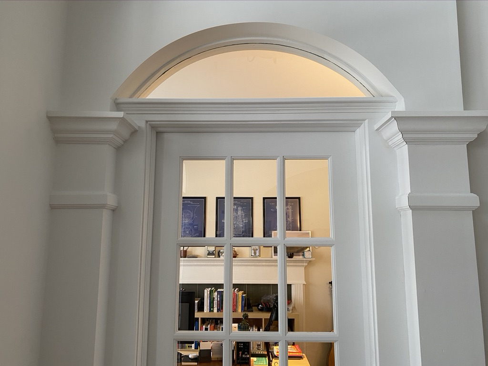

+++
title = "Architecture for Sheltering in Place"
date = "2021-01-17T15:12:00Z"
author = "David Howell"
tags = ["Notebook"]
+++

Nearly a year ago, my family went from separating to work and school each morning to permanently cloistered together, with varying degrees of rebellion against the demands of sheltering in place with small children. We have been back to regular childcare for months, but the slow pace of vaccination and the B.1.1.7 variant loom over my partner and I. The prospect of once more trying to keep each other and the children sane while nominally keeping up with our full time responsibilities often greets me when I wake in the middle of the night.

We barely succeeded at juggling parenting, two different meeting schedules, and remote schooling. There were spreadsheets and we will wield them again if we must. But this time, at least, I have an office door.

My home office was separated from the rest of first floor (and the sounds of sibling altercations, meals rejected, and Kidz Bop dance parties) only by an open archway. I now work permanently remote, for a West coast company that occasionally requires meetings in the evening. We didn't know whether it was feasible to fill in the archway, but we found a contractor with a good eye and now my partner and I can each get quiet when we need it — her in the finished basement, me behind this glass.

I could never have anticipated how much I like the look of the final product. It doesn't quite look like original construction, but it does fit. I like how it is clearly an adaptation, a mark on our architecture of the same year that changed how many of us relate to a well-stocked pantry and an ample supply of toilet paper.