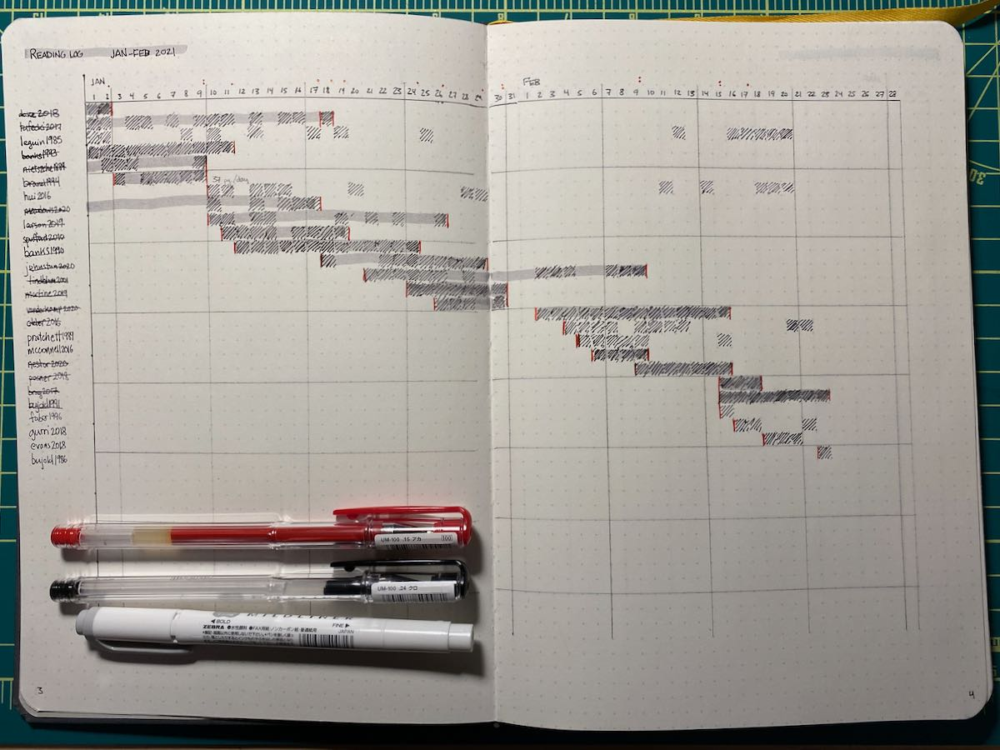

It's hard to predict which rituals will stick and which will fizzle out. Two years ago, I started keeping a reading log in [a large-size Baron Fig Confidant notebook][1]. It's a timeline, with each row representing a book and each column representing one day. If I read any amount of that book during the day, I fill in that square. I use a red line to mark the start and finish dates for a book and once I finish a book, I color the range of days when I was reading that book with a gray highlighter.

I didn't design all this up-front, but just tinkered with the layout and styling every time I drew a new two-month span. I've tried more color coding, single-month layouts, and a few other things. Ultimately I converged on the current look about a year in and it's stuck since then.

The total effort to keep up with this is probably 10 minutes every two months to draw the page layout and less than a minute at the end of each day to pull the notebook off the shelf and log that day's reading.

Yes, I know that [goodreads][2] exist and I use that sometimes, too. The notebook loads a lot faster, though. I'm also never embarrassed to admit to the notebook what I'm reading!

[1]: https://www.baronfig.com/tools/confidant/classic?size=plus+%287%22+x+10%22%29&paper+type=dot+grid&color=charcoal
[2]: https://www.goodreads.com/user/show/51711-dave